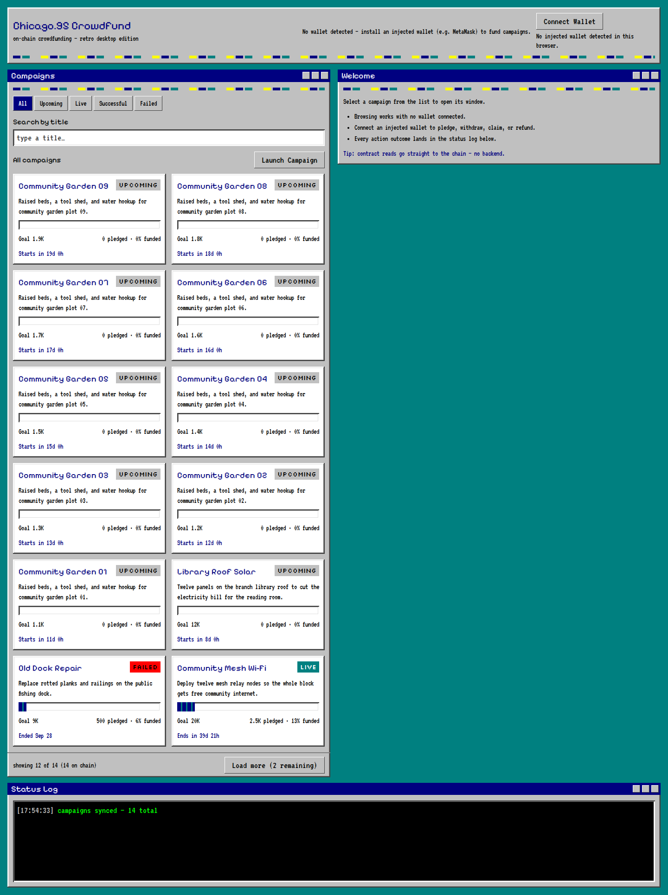

# Chicago.95 CrowdFund

[](https://github.com/MohammedSoliman10/crowdfund/actions/workflows/ci.yml)

**On-chain crowdfunding, desktop edition.** A pixel-faithful Chicago.95 retro
desktop UI over a minimal Solidity crowdfunding protocol — teal desktop, navy
title bars, beveled silver chrome, and a green-on-black status terminal, with
every read served straight from the chain.

**Live demo:** https://crowdfund-soliman11.vercel.app
**Networks:** Anvil `31337` (local, seeded) · Sepolia `11155111` (live target)



---

## What it does

| Area | Details |
|---|---|
| **Browse** | Newest-first campaign list, status tabs (All / Upcoming / Live / Successful / Failed), title search, "Load more" paging. Cancelled campaigns are dropped (deleted on-chain). |
| **Campaign windows** | Progress bar, goal/pledged/funded figures, start/end countdowns, creator, status chip. |
| **Backers** | Pledge CFT with an automatic exact-amount ERC-20 `approve`, withdraw a pledge, refund a failed campaign. |
| **Creators** | Launch (title ≤ 80 chars, description ≤ 500, max 90 days), cancel, claim funds after success. |
| **Status Log** | Every outcome — syncs, confirms, rejections — lands as a plain-English line in the terminal panel. |
| **Errors** | Two-layer mapping: client-side validation *before* any transaction, and contract reverts translated to human sentences (never raw revert data). |
| **Accessibility** | Full keyboard operation, visible focus, WCAG-AA contrast where achievable, resizable text, responsive from 1024px. |

**Wallets:** injected only (MetaMask & friends). No seed phrases, no custodial
accounts, no backend — wrong-network detection and a switch prompt are built in.

## Design system

Faithful to the Chicago.95 reference, enforced by design tokens:

- **Chrome** — teal desktop, navy title bars, 2px silver bevels, radius `0`,
  90° corners, dashed multicolor accent strips
- **Type** — VT323 · Pixelify Sans · Silkscreen (self-hosted via `@fontsource`)
- **Palette** — strict 8/16-color; terminal is green-on-black
- **Components** — retro `Window`, `Dialog`, `Button`, `TextInput`, `Checkbox`,
  `ProgressBar`, status chips… all sharing the same bevel language

## Architecture

```
Browser ──reads──▶ public RPC (viem) ──▶ CrowdFund.sol + MockToken (CFT)
   │                                          ▲
   └──writes──▶ user's wallet (signs) ────────┘
```

- **Frontend only** — React 18 + TypeScript + Vite, wagmi/viem, TanStack
  Query, Tailwind (config-based tokens). No server, database, or indexer.
- **No secrets ship in the bundle** — the app contains no private keys and no
  API keys; transactions are signed inside the user's wallet. `VITE_*` env vars
  are contract *addresses*, not credentials.
- **Contracts** — Foundry project: `CrowdFund.sol` (crowdfund state machine)
  plus a `MockToken` ERC-20 used as the pledge currency. The only extension to
  the fixed base behavior is on-chain `title`/`description` (≤ 80 / ≤ 500 bytes,
  validated at `launch()`).

## Repository layout

```
├── contracts/          Foundry: CrowdFund.sol, tests, deploy script
├── frontend/           Vite app: src/, tests/unit, tests/e2e, scripts/
├── specs/001-crowdfund-frontend-ui/
│   ├── spec.md         21 functional requirements, 8 success criteria
│   ├── plan.md · tasks.md (66) · checklists/
│   └── quickstart.md   17 runnable scenarios
├── .specify/           Spec Kit tooling
├── .github/workflows/  CI: lint · types · unit · build · forge test
└── vercel.json         Monorepo build config for Vercel
```

## Quickstart (local)

```bash
# 1 — chain (terminal A)
anvil

# 2 — contracts + seed data (terminal B)
cd contracts
forge script script/Deploy.s.sol:DeployScript --broadcast \
  --rpc-url http://127.0.0.1:8545 --private-key <anvil-account-0-key>
cd ../frontend
npm install
node scripts/seed.mjs && node scripts/verify.mjs   # expect: VERIFY OK

# 3 — UI (terminal B)
npm run dev                                        # http://localhost:5173
```

**Wallet:** add a network `http://127.0.0.1:8545`, chain ID `31337`, then
import an Anvil dev account (the public dev keys are listed in
[frontend/README.md](frontend/README.md)). Browsing works with **no wallet**;
connecting unlocks pledge / launch / claim / refund.

## Tests

| Gate | Command | Count |
|---|---|---|
| Contracts | `cd contracts && forge test` | **31 ✅** |
| Unit (Vitest + Testing Library) | `cd frontend && npm run test:unit` | **144 ✅** |
| E2E (Playwright, real chain) | `cd frontend && npm run test:e2e` | **20 ✅** |
| Static | `npm run lint && npm run typecheck && npm run build` | 0 issues ✅ |

All of the above run on every push via GitHub Actions.

> **E2E note:** tests mutate the chain — reseed first (`pkill -x anvil`,
> restart, deploy, `node scripts/seed.mjs`). First-time Playwright setup:
> `npx playwright install --with-deps chromium`.

## Deployment

**Frontend → Vercel** (already live): `vercel.json` at the repo root points the
build at `frontend/`, so importing the repo just works. Pushes to `main`
auto-deploy; CI gates run in parallel.

**Contract → Sepolia** (final step for public use):

```bash
cd contracts
forge script script/Deploy.s.sol:DeployScript --broadcast \
  --rpc-url <sepolia-rpc> --private-key <funded-key> --verify
```

Then in Vercel: **Settings → Environment Variables**

```
VITE_SEPOLIA_CROWDFUND_ADDRESS=0x…
VITE_SEPOLIA_TOKEN_ADDRESS=0x…
```

and redeploy (env vars are baked at build time). Until then the app shows
*“not deployed on this network”* on Sepolia — by design.

## Spec-driven development

This project was built with GitHub Spec Kit
(`/speckit.specify → clarify → plan → tasks → checklist → implement`).
The complete trail — requirements, clarification Q&amp;A, architecture plan,
task breakdown, validation record, and consistency review — lives in
[specs/001-crowdfund-frontend-ui/](specs/001-crowdfund-frontend-ui/).
Quality-checklist sign-off (`checklists/quality.md`) is reviewer-owned and
intentionally left unchecked.
